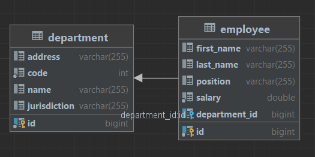

<h1 align="center">Digital Chief</h1>

----

----
## Stack
Java, Spring Boot, Maven, JDBC, Hibernate, SQL, JSON, Lombok.
____
## Краткое описание
Данное Spring Boot приложение обладает простой функциональностью CRUD:
- создание - CREATE
- чтение - READ
- обновление - UPDATE
- удаление - DELETE
____
## Структура БД
<p align="center">
</p> 

### Department:
- id
- code - числовой код отделения
- name - название отделения
- jurisdiction - ответственность отделения(регион)
- address - адрес отделения

### Employee:
- id
- first_name - имя сотрудника
- last_name - фамилия сотрудника
- position - должность сотрудника
- salary - заработная плата
- department_id - id отделения в котором работает данный сотрудник

___
## API
___
- GET /departments
<details>
<summary>Response</summary>

```
[
  {
    "id": 1,
    "code": 101,
    "name": "Moscow Department",
    "address": "Moscow, Tverskaya st., 88",
    "jurisdiction": "ALL"
  },
  {
    "id": 2,
    "code": 202,
    "name": "Volga Department",
    "address": "Samara, Marksa st.,3",
    "jurisdiction": "SOUTH"
  },
  {
    "id": 3,
    "code": 303,
    "name": "Altay Department",
    "address": "Barnaul, Lenina st., 32B",
    "jurisdiction": "CENTRAL"
  }
]
```
</details>

___
- GET /departments/{id}
<details>
<summary>Response</summary>

```
{
    "id": 3,
    "code": 303,
    "name": "Altay Department",
    "address": "Barnaul, Lenina st., 32B",
    "jurisdiction": "CENTRAL"
 }
```
</details>

___
- GET /employees
<details>
<summary>Response</summary>

```
[
    {
        "id": 1,
        "lastName": "Ivanov",
        "firstName": "Ivan",
        "salary": 100000.0,
        "position": "SHERIF",
        "department": {
            "id": 1,
            "code": 101,
            "name": "Moscow Department",
            "address": "Moscow, Tverskaya st., 78",
            "jurisdiction": "ALL"
        }
    },
    {
        "id": 2,
        "lastName": "Petrov",
        "firstName": "Petr",
        "salary": 150000.0,
        "position": "OFFICE_MANAGER",
        "department": {
            "id": 2,
            "code": 202,
            "name": "Volga Department",
            "address": "Samara, Marksa st.,3",
            "jurisdiction": "SOUTH"
        }
    },
    {
        "id": 3,
        "lastName": "Konev",
        "firstName": "Vladimir",
        "salary": 90000.0,
        "position": "SHERIF",
        "department": {
            "id": 3,
            "code": 303,
            "name": "Altay Department",
            "address": "Barnaul, Lenina st., 32B",
            "jurisdiction": "CENTRAL"
        }
    },
    {
        "id": 4,
        "lastName": "Toparev",
        "firstName": "Alexey",
        "salary": 71500.0,
        "position": "STAFF_OFFICER",
        "department": {
            "id": 1,
            "code": 101,
            "name": "Moscow Department",
            "address": "Moscow, Tverskaya st., 78",
            "jurisdiction": "ALL"
        }
    },
    {
        "id": 5,
        "lastName": "Jorina",
        "firstName": "Anastasiya",
        "salary": 148700.0,
        "position": "OFFICE_MANAGER",
        "department": {
            "id": 2,
            "code": 202,
            "name": "Volga Department",
            "address": "Samara, Marksa st.,3",
            "jurisdiction": "SOUTH"
        }
    },
    {
        "id": 6,
        "lastName": "Popov",
        "firstName": "Alexandr",
        "salary": 87650.0,
        "position": "STAFF_OFFICER",
        "department": {
            "id": 3,
            "code": 303,
            "name": "Altay Department",
            "address": "Barnaul, Lenina st., 32B",
            "jurisdiction": "CENTRAL"
        }
    }
]
```
</details>

___
- GET /employees/{id}
<details>
<summary>Response</summary>

```
{
    "id": 1,
    "lastName": "Ivanov",
    "firstName": "Ivan",
    "salary": 100000.0,
    "position": "SHERIF",
    "department": {
        "id": 1,
        "code": 101,
        "name": "Moscow Department",
        "address": "Moscow, Tverskaya st., 78",
        "jurisdiction": "ALL"
    }
}
```
</details>

___
- POST /departments
<details>
<summary>Request Body</summary>

```
{
  "id": 3,
  "code": 303,
  "name": "Altay Department",
  "address": "Barnaul, Lenina st., 32B",
  "jurisdiction": "CENTRAL"
}
```
</details>
<details>
<summary>Response</summary>

```
Updated
```

```
Created
```
</details>

___
- POST /departments/{id}
<details>
<summary>Request Body</summary>

```
{
  "code": 303,
  "name": "Altay Department",
  "address": "Barnaul, Lenina st., 32B",
  "jurisdiction": "CENTRAL"
}
```
</details>
<details>
<summary>Response</summary>

```
Department updated
```

```
Incorrect info
```
</details>

___
- POST /employees
<details>
<summary>Request Body</summary>

```
{
   "id": 100,
   "lastName": "Ivanov",
   "firstName": "Ivan",
   "salary": 100000.0,
   "position": "SHERIF",
   "departmentId": 2
}
```
</details>
<details>
<summary>Response</summary>

```
Updated
```

```
Created
```
</details>

___
- POST /employees/{id}
<details>
<summary>Request Body</summary>

```
{
   "lastName": "Ivanov",
   "firstName": "Ivan",
   "salary": 100000.0,
   "position": "SHERIF",
   "departmentId": 2
}
```
</details>
<details>
<summary>Response</summary>

```
Employee updated
```

```
Incorrect info
```
</details>

___
- DELETE /departments
<details>
<summary>Response</summary>

```
All departments are deleted
```

```
Incorrect info
```
</details>

___
- DELETE /departments/{id}
<details>
<summary>Response</summary>

```
Department with id=2 is deleted
```

```
Incorrect info
```
</details>

___
- DELETE /employees
<details>
<summary>Response</summary>

```
All employees are deleted
```

```
Incorrect info
```
</details>

___
- DELETE /employees/{id}
<details>
<summary>Response</summary>

```
Employee with id=2 is deleted
```

```
Incorrect info
```
</details>

___
## Запросы
<details>
<summary>Подробнее</summary>

```
###
GET http://localhost:8080/departments

###
GET http://localhost:8080/employees

###
GET http://localhost:8080/departments/{{id}}

###
GET http://localhost:8080/employees/{{id}}

###
DELETE http://localhost:8080/employees

###
DELETE http://localhost:8080/employees/{{id}}

###
DELETE http://localhost:8080/departments

###
DELETE http://localhost:8080/departments/{{id}}

###
POST http://localhost:8080/departments
Content-Type: application/json

{
"id": 101,
"code": 101,
"name": "Moscow Department",
"address": "Moscow, Tverskaya st., 88",
"jurisdiction": "ALL"
}

###
POST http://localhost:8080/employees
Content-Type: application/json

{
"id": 101,
"lastName": "Ivanov",
"firstName": "Ivan",
"salary": 100000.0,
"position": "SHERIF",
"departmentId": 2
}

###
POST http://localhost:8080/departments/{{id}}
Content-Type: application/json

{
"code": 303,
"name": "Altay Department",
"address": "Barnaul, Lenina st., 32B",
"jurisdiction": "CENTRAL"
}

###
POST http://localhost:8080/employees/{{id}}
Content-Type: application/json

{
"lastName": "Ivanov",
"firstName": "Ivan",
"salary": 100000.0,
"position": "SHERIF",
"departmentId": 2
}
```
</details>

___
## Как запустить
Для работы приложения необходимо:
<li>установить MySQL (8.0);</li>
<li>настроить соединение с базой данных по конфигурации - application.yaml.</li>

```
server:
  port: 8080

spring:
  datasource:
    username: root
    password: password
    url: jdbc:mysql://localhost:3306/digitalTest?useSSL=false&requireSSL=false&allowPublicKeyRetrieval=true
  jpa:
    properties:
      hibernate:
        dialect: org.hibernate.dialect.MySQL8Dialect
```
____